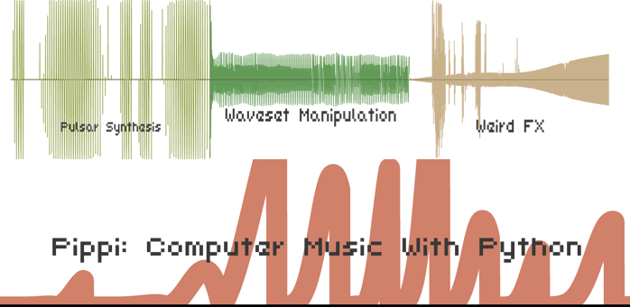

# Pippi: Computer Music With Python

v2.0.0 - Beta 4 (In Development)

Source code: [https://github.com/luvsound/pippi](https://github.com/luvsound/pippi)

Documentation: [https://pippi.world](https://pippi.world)

## What is this?

Pippi is a library of computer music modules for python. 

It includes a few handy data structures for music like
`SoundBuffer` & `Wavetable`, which are operator-overloaded 
to make working with sounds and control structures simpler.

It also includes a lot of useful methods for doing common and 
not-so-common transformations to sounds and control structures. 

    from pippi import dsp

    sound1 = dsp.read('sound1.wav')
    sound2 = dsp.read('sound2.flac')

    # Mix two sounds
    both = sound1 & sound2

    # Apply a skewed hann Wavetable as an envelope to a sound
    enveloped = sound * dsp.win('hann').skewed(0.6)

    # Or the same, via a shortcut method on the `SoundBuffer`
    enveloped = sound.env('hann')

    # Synthesize a 10 second graincloud from the sound, 
    # with grain length modulating between 20ms and 2s 
    # over a hann shaped curve.
    cloudy = enveloped.cloud(10, grainlength=dsp.win('hann', dsp.MS*20, 2))

It comes with several oscs:

- `Alias` - a highly aliased pulse train osc
- `Bar` - a bar physical model (from Soundpipe)
- `Drunk` - does a drunk walk on the y axis over a fixed set of random points w/hermite interpolation for smooth waveshapes (kind of like dynamic stochastic synthesis in one dimension)
- `DSS` - a basic implementation of dynamic stochastic synthesis that does a drunk walk in two dimensions over a random set of breakpoints
- `FM` - a basic two operator FM synth w/harmonicity ratio & modulation index controls
- `Fold` - an infinite folding wavetable osc
- `Osc` - an everyday wavetable osc
- `Osc2d` - a 2d morphing wavetable osc
- `Pluck` - a plucked string physical model (adapted from JOS)
- `Pulsar` - a pulsar synthesis engine
- `Pulsar2d` - a 2d morphing pulsar synthesis engine (pairs well with a stack of wavetables extracted with the `Waveset` module)
- `SineOsc` - a simple sinewave osc (doesn't use wavetables)
- `Tukey` - a tukey-window-based osc with waveshape modulation between square-like and sine-like

And many built-in effects and transformations:

- Easy independent control over pitch and speed for any `SoundBuffer`
- Paulstretch
- Several forms of waveshaping and distortion including a crossover distortion ported from supercollider
- Sweapable highpass, lowpass, bandpass and band reject butterworth filters from Soundpipe
- Lots more!

As well as support for pitch and harmony transformations and non-standard tuning systems

    from pippi import tune

    # Get a list of frequencies from a list of scale degrees
    frequencies = tune.fromdegrees([1,3,5,9], octave=3, root='a', scale=tune.MINOR, ratios=tune.JUST)

    # Get a list of frequencies from a chord symbol using a tuning system devised by Terry Riley
    frequencies = tune.chord('ii69', key='g#', octave=5, ratios=tune.TERRY)

    # Convert MIDI note to frequency
    freq = tune.mtof(60)

    # Convert frequency to MIDI note
    note = tune.ftom(440.0)

    # Convert a pitch to a frequency
    freq = tune.ntf('C#3')

And basic graphing functionality for any `SoundBuffer` or `Wavetable` -- some dumb examples pictured in the banner above.

    from pippi import dsp

    sound = dsp.read('sound.wav')

    # Render an image of this sound's waveform
    sound.graph('mysound.png')

    # Render an image of a sinc wavetable with a label and scaled range
    dsp.win('sinc').graph('sinc.png', label='A sinc wavetable', y=(-.25, 1))

As well as other neat stuff like soundfont rendering support via tinysf!

    from pippi import dsp, soundfont

    # Play a piano sound from a soundfont with general MIDI support (program change is zero-indexed)
    tada = soundfont.play('my-cool-soundfont.sf2', length=30, freq=345.9, amp=0.5, voice=0)

    # Save copy to your hard disk
    tada.write('tada.wav')

## Tutorials

There are annotated example scripts in the [tutorials](docs/tutorials) directory which introduce some of pippi's functionality.

Beyond arriving at a good-enough stable API for the 2.x series of releases (and fixing bugs), my goal during the 
beta phase of development is to deal with the lack of documentation for this project.

## Installation

Pippi requires python 3.6+ which can be found here:

    https://www.python.org/downloads/

The 3.5.x branch of python might work too, but is untested.

> raspbian buster users: you must install the `libatlas-base-dev` package with `apt` to build the latest version of numpy.

To install pippi:

- Clone this repository locally: `git clone https://github.com/luvsound/pippi.git`
- _(Optional but recommended)_ Create a virtualenv somewhere where you want to work: `cd /my/pippi/projects; python3 -m venv venv; source venv/bin/activate`
- _(With your virtualenv active)_ Go back to the pippi source directory `cd /path/to/pippi` and run `make install` 

The final command does a few things:

- Installs python deps, so *make sure you're inside a virtual environment* if you want to be!
- Sets up git submodules for external libs
- Builds and installs Soundpipe
- Builds and installs pippi & cython extensions

Please let me know if you run into problems!

### From pypi

At the moment the best place to get pippi is using the method described above. Because of some packaging issues that need to be worked out, the version on pypi is quite a bit older and does not include most of the fun stuff.

## To run tests

    make test

In many cases, this will produce a soundfile in the `tests/renders` directory for the corresponding test. (Ear-driven regression testing...)
During the beta I like to keep failing tests in the main repo, so... most tests will be passing but if they *all* are passing, probably you are living in the future and are looking at the first stable release.

There are also shortcuts to run only certain groups of tests, like `test-wavesets` -- check out the `Makefile` for a list of them all.

## Hacking

While hacking on pippi itself, running `make build` will recompile the cython extensions.

If you need to build sources from a clean slate (sometimes updates to `pxd` files require this) then run `make clean build` instead.

## Thanks

[Project Nayuki](https://www.nayuki.io/page/free-small-fft-in-multiple-languages) for a compact FFT! (Used in `SoundBuffer.convolve()`)

[Paul Batchelor](https://github.com/PaulBatchelor/Soundpipe) for all the goodness in Soundpipe that has made its way into Pippi. (See the `fx` and `bar` modules.)

[Bernhard Schelling](https://zillalib.github.io/) for his TinySoundFont library used in the `soundfont` module.

[Nando Florestan](http://dev.nando.audio/) for his small public domain GM soundfont used in the test suite.

[Pixeldroid](https://github.com/pixeldroid/fonts) for their OFL licensed console font used for labeling graphs.

[@noisesmith@sonomu.club](https://sonomu.club/@noisesmith) for introducing me to the modulation param on tukey windows

[James McCartney](https://www.musicdsp.org/en/latest/Other/93-hermite-interpollation.html) for his implementation of hermite interpolation used in the `Wavetable` module and elsewhere.

[Starling Labs](https://starling.space/) for their zener diode softclip simulation and state variable filter implementation available in the `fx` module.

[Jatin Chowdhury](https://ccrma.stanford.edu/~jatin/ComplexNonlinearities/Wavefolder.html) for their lovely sounding saturating feedback wavefolder.
