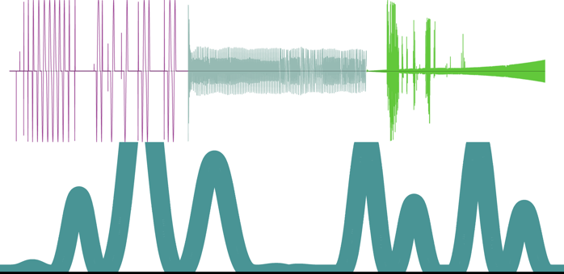

## Pippi: Computer music with python

v2.0.0 - Beta 4 (In Development)

## What is this?

Pippi is a computer music library for python. 

It includes a few handy data structures for music like
`SoundBuffer` & `Wavetable`, which are operator-overloaded 
to make working with sounds and control structures simpler.

It also includes a lot of useful methods for doing common and 
not-so-common transformations to sounds and control structures. 

    # Mix two sounds
    both = sound1 & sound2

    # Apply a skewed hann Wavetable as an envelope to a sound
    enveloped = sound * dsp.win('hann').skewed(0.6)

    # Or the same, via a shortcut method on the `SoundBuffer`
    enveloped = sound.env('hann')

    # Synthesize a 10 second graincloud from the sound, 
    # with grain length modulating between 20ms and 2s 
    # over a hann shaped curve.
    cloudy = enveloped.cloud(10, grainlength=dsp.win('hann', dsp.MS*20, 2))

It comes with several oscs:

    - Pulsar - a pulsar synthesis engine
    - Pulsar2d - a 2d morphing pulsar synthesis engine
    - Tukey - a tukey-window-based osc with waveshape modulation between square-like and sine-like
    - Osc - an everyday wavetable osc
    - Osc2d - a 2d morphing wavetable osc
    - Fold - an infinite folding wavetable osc
    - Bar - a bar physical model (from Soundpipe)
    - Pluck - a plucked string physical model (adapted from JOS)
    - Alias - a highly aliased pulse train osc

And many built-in effects and transformations:

    - Easy independent control over pitch and speed for any `SoundBuffer`
    - Paulstretch
    - Several forms of waveshaping and distortion including a crossover distortion ported from supercollider
    - Sweapable highpass, lowpass, bandpass and band reject butterworth filters from Soundpipe
    - Lots more!

## Installation

Pippi requires python 3.6+ which can be found here:

    https://www.python.org/downloads/

The 3.5.x branch of python might work too, but is untested.

To use the most recent release from pip (currently `2.0.0 beta 3`) just:

    pip install pippi

*But!* Please see below about installing the latest version from source, there are a lot of new features in the most recent beta.

## Tutorials

There are annotated example scripts in the [tutorials](tutorials) directory which introduce some of pippi's functionality.

Beyond arriving at a good-enough stable API for the 2.x series of releases (and fixing bugs), my goal during the 
beta phase of development is to deal with the lack of documentation for this project.

## Install from source

> raspbian buster users: you must install the `libatlas-base-dev` package with `apt` to build the latest version of numpy.

To install pippi:

    make install

Which does a few things:

- Installs python deps, so *make sure you're inside a virtual environment* if you want to be!
- Sets up git submodules for external libs
- Builds and installs Soundpipe
- Builds and installs pippi & cython extensions

Please let me know if you run into problems!

## To run tests

    make test

In many cases, this will produce a soundfile in the `tests/renders` directory for the corresponding test. (Ear-driven regression testing...)
During the beta I like to keep failing tests in the main repo, so... most tests will be passing but if they *all* are passing, probably you are living in the future and are looking at the first stable release.

There are also shortcuts to run only certain groups of tests, like `test-wavesets` -- check out the `Makefile` for a list of them all.

## Hacking

While hacking on pippi itself, running `make build` will recompile the cython extensions.

If you need to build sources from a clean slate (sometimes updates to `pxd` files require this) then run `make clean build` instead.

## Thanks

[Project Nayuki](https://www.nayuki.io/page/free-small-fft-in-multiple-languages) for a compact FFT! (Used in `SoundBuffer.convolve()`)

[Paul Batchelor](https://github.com/PaulBatchelor/Soundpipe) for all the goodness in Soundpipe that has made its way into Pippi. (See the `fx` and `bar` modules.)

[Bernhard Schelling](https://zillalib.github.io/) for his TinySoundFont library used in the `soundfont` module.

[Nando Florestan](http://dev.nando.audio/) for his small public domain GM soundfont used in the test suite.

[Pixeldroid](https://github.com/pixeldroid/fonts) for their OFL licensed console font used for labeling graphs.

